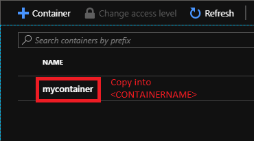

# Azure Storage


Databricks-Specific Content


## Mounting Blob Storage

Once you create your blob storage account in Azure, you will need to grab a couple bits of information from the Azure Portal before you mount your storage.

1. You can find your Storage Account Name (which will go in <STORAGEACCOUNT> below) and your Key (which will go in <KEYGOESHERE> below) under **Access Keys** in your Storage Account resource in Azure.


2. Go into your Storage Account resource in Azure and click on **Blobs**. Here, you will find all of your containers. Pick the one you want to mount and copy  its name into <CONTAINERNAME> below.



3. As for the mount point (`/mnt/<FOLDERNAME>` below), you can name this whatever you'd like, but it will help you in the long run to name it something useful along the lines of `storageaccount_container`.

Once you have the required bits of information, you can use the following code to mount the storage location inside the Databricks environment

```python
dbutils.fs.mount(
  source = "wasbs://<CONTAINERNAME>@<STORAGEACCOUNT>.blob.core.windows.net",
  mount_point = "/mnt/<FOLDERNAME>/",
  extra_configs = {"fs.azure.account.key.<STORAGEACCOUNT>.blob.core.windows.net":"<KEYGOESHERE>"})
```

### Resources:

* To learn how to create an Azure Storage service, visit [https://docs.microsoft.com/en-us/azure/storage/](https://docs.microsoft.com/en-us/azure/storage/)
